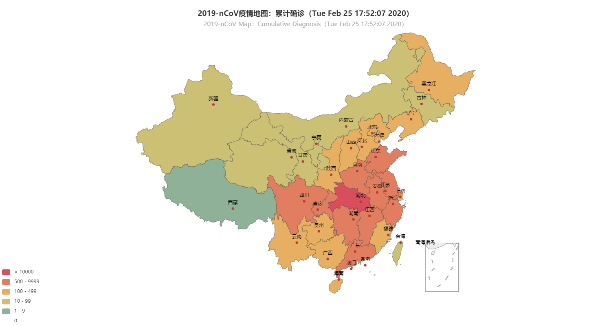
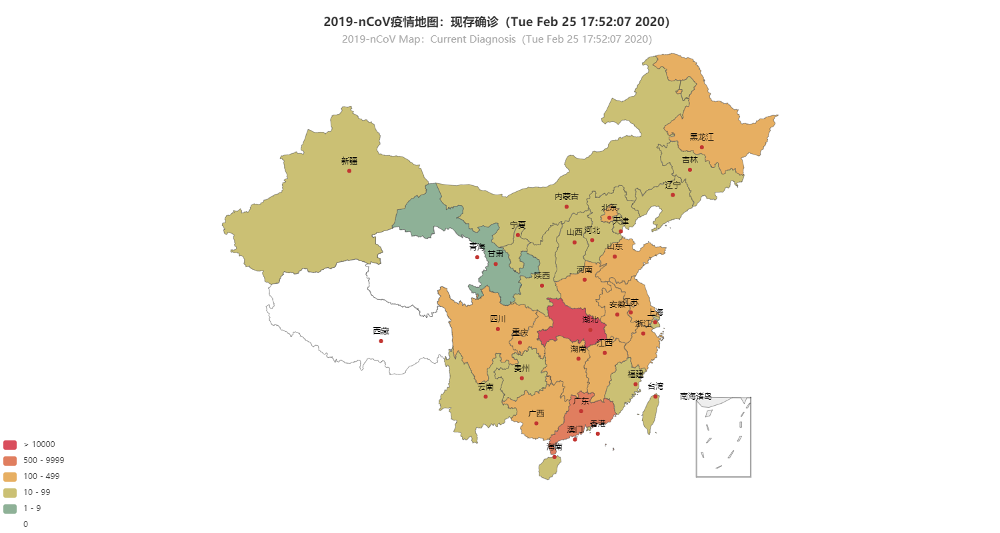
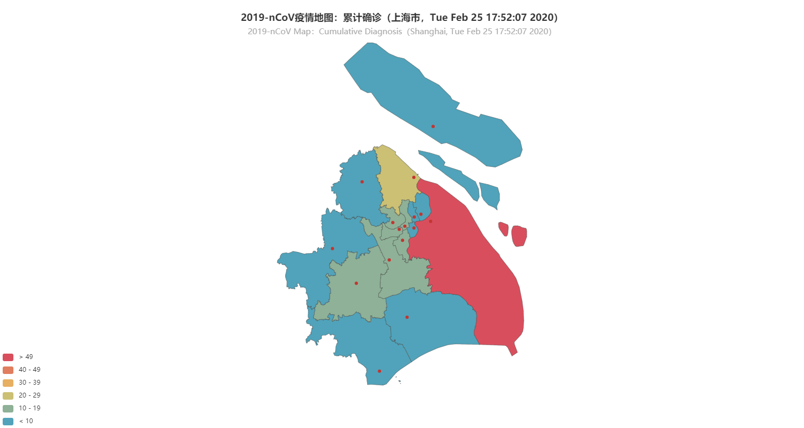

# 2019_nCoV_analyze

2019新型冠状病毒可视化分析项目。  
A simple visualization program of 2019 n-CoV distribution.

基于[requests](https://requests.readthedocs.io/zh_CN/latest/)、[BeautifulSoup](https://www.crummy.com/software/BeautifulSoup/bs4/doc/#quick-start)、[pyecharts](https://pyecharts.org/#/zh-cn/)实现了简单的2019新型冠状病毒数据的获取、清洗及可视化。  
Data acquisition, cleaning, and visualization are based on the packages of [requests](https://requests.readthedocs.io/en/master/), [BeautifulSoup](https://www.crummy.com/software/BeautifulSoup/bs4/doc/#quick-start), and [pyecharts](https://pyecharts.org/#/en-us/), respectively.

### 文件说明 Document Illustration

||||
|------|------|------| 
|main.py | 主要的代码文件 | Code File  |
|render.html | 结果文件（html格式） | Result (html format) | 
|png/ | 结果文件（png格式） | Result (png format) | 
|ppt/  | 项目详细说明 | Project Detailed Illustration|

### 成果 Results
[Html 格式](render.html) (推荐)  
[Html Format](render.html) (Recommend)

PNG格式:  
PNG Format:  

    

   

   